# SOC Threat Hunting — Análisis de beaconing con Zeek (SEC-HUNT-001)

[](https://github.com/CarlosGutierrezR/soc-threat-hunting-zeek/actions/workflows/ci.yml)


*Threat hunt* guiado por hipótesis para detectar **beaconing** de mando y control
(C2) en la telemetría `conn` de Zeek, capturada en un laboratorio SOC propio y
segmentado (pfSense, Security Onion, Wazuh, Active Directory). Las conexiones se
agrupan, se mide el tiempo entre llegadas, los grupos se ordenan por regularidad
temporal (coeficiente de variación) y cada candidato recibe un veredicto
documentado del analista.

> **Resultado:** la hipótesis se investigó y **no se confirmó**. Los dos grupos
> más periódicos eran legítimos (multicast IGMP y DHCP). La periodicidad es una
> señal para priorizar, no una detección.

**Contenido:** [Inicio rápido](#inicio-rápido-para-revisores) ·
[Entorno de laboratorio](#entorno-de-laboratorio) ·
[Recorrido paso a paso](#recorrido-paso-a-paso) ·
[Resultados](#resultados) · [Uso](#uso) · [Estructura](#estructura-del-repositorio) ·
[Limitaciones](#limitaciones-y-próximos-pasos) · [English](#-english-summary)

## Inicio rápido para revisores

```bash
git clone https://github.com/CarlosGutierrezR/soc-threat-hunting-zeek.git
cd soc-threat-hunting-zeek
python -m venv .venv && source .venv/bin/activate   # Windows: .venv\Scripts\activate
pip install -r requirements-dev.txt
pytest                                               # pruebas unitarias + extremo a extremo
python -m src.cli --input samples/synthetic-conn.jsonl
```

Sin dependencias de terceros en ejecución (solo biblioteca estándar). La
muestra incluida es **sintética** y tiene la respuesta correcta conocida
(*ground truth*) — ver [`samples/README.md`](samples/README.md). El dataset real
del laboratorio no se publica; su SHA-256 está registrado en el
[manifiesto de evidencia](evidence/evidence-manifest.md).

## Qué demuestra este proyecto

| Competencia | Dónde se ve |
|---|---|
| Construir y validar un pipeline de monitorización (sensor → Zeek → Elasticsearch) | [Recorrido, pasos 1–3](#recorrido-paso-a-paso) |
| *Hunting* guiado por hipótesis (alcance, salvaguardas, categorías de veredicto) | [`docs/hypothesis.md`](docs/hypothesis.md) |
| Análisis estadístico de *beaconing* sobre datos de Zeek | [`src/features.py`](src/features.py) |
| Validación del analista y gestión de falsos positivos | [`docs/analyst-validation.md`](docs/analyst-validation.md) |
| Gestión de evidencia (dataset congelado, SHA-256, capturas) | [`evidence/`](evidence) |
| Comunicación honesta de limitaciones | [`docs/limitations.md`](docs/limitations.md) |
| Python con pruebas y CI | [`tests/`](tests), [`.github/workflows/ci.yml`](.github/workflows/ci.yml) |

## Entorno de laboratorio

Todos los sistemas son máquinas virtuales en un único host VMware Workstation.
pfSense segmenta el laboratorio en redes internas aisladas; el sensor de
Security Onion monitoriza el segmento de endpoints.

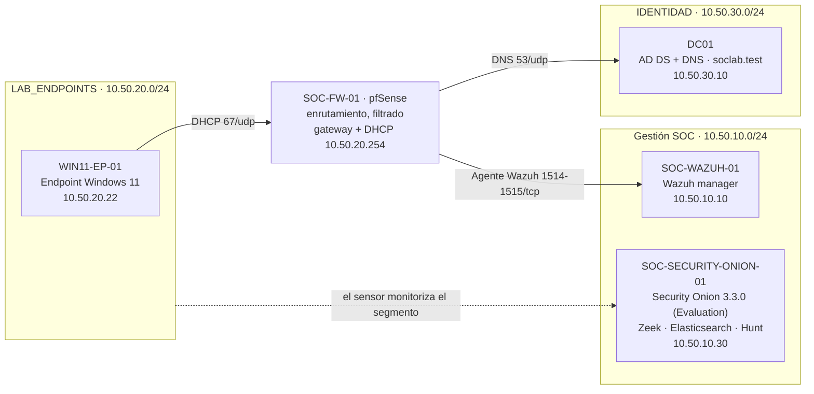

| Componente | Papel en este hunt |
|---|---|
| `SOC-FW-01` (pfSense) | Enrutamiento y filtrado entre segmentos; DHCP del segmento de endpoints (`10.50.20.254`) |
| `SOC-SECURITY-ONION-01` (Security Onion 3.3.0, Evaluation) | Sensor de red: logs de Zeek, almacenamiento en Elasticsearch, interfaz Hunt |
| `WIN11-EP-01` | Endpoint investigado (`10.50.20.22`) |
| `DC01` | Active Directory Domain Services y DNS de `soclab.test` (`10.50.30.10`) |
| `SOC-WAZUH-01` | Wazuh manager; el agente del endpoint reporta por `1514/tcp` y se registra por `1515/tcp` |

## Recorrido paso a paso

Cada paso enlaza la afirmación con la captura que la respalda. Todas las
capturas están en [`evidence/screenshots/`](evidence/screenshots) y se describen
en [`evidence/README.md`](evidence/README.md).

### 1. Verificar que la plataforma de monitorización está sana

El grid de Security Onion muestra el nodo `onion` (rol Evaluation, `10.50.10.30`,
versión 3.3.0) en estado **OK**, y Elastic Fleet muestra los dos agentes
(`FleetServer-onion`, `onion`) como **Healthy**.

<p>
  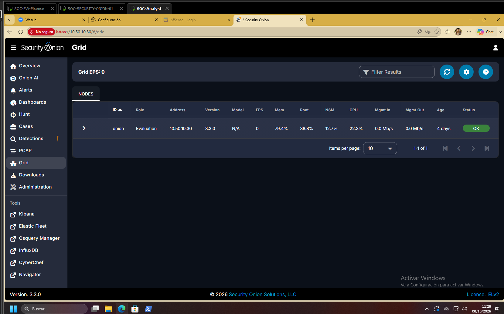
  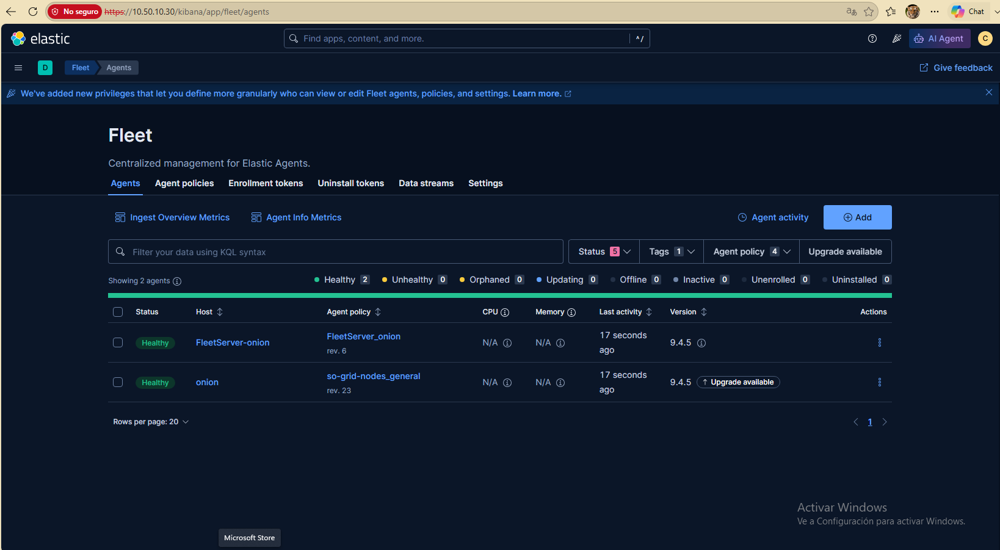
</p>

### 2. Confirmar que el sensor ve el tráfico del endpoint

`tcpdump` en la interfaz del sensor muestra paquetes de `10.50.20.22` (DNS hacia
`10.50.30.10`, TCP hacia `10.50.10.10`, ARP con el gateway) con 0 paquetes
descartados por el kernel. Zeek escribe `conn.log` y `dns.log` en JSON en
`/nsm/zeek/logs/current/`.

<p>
  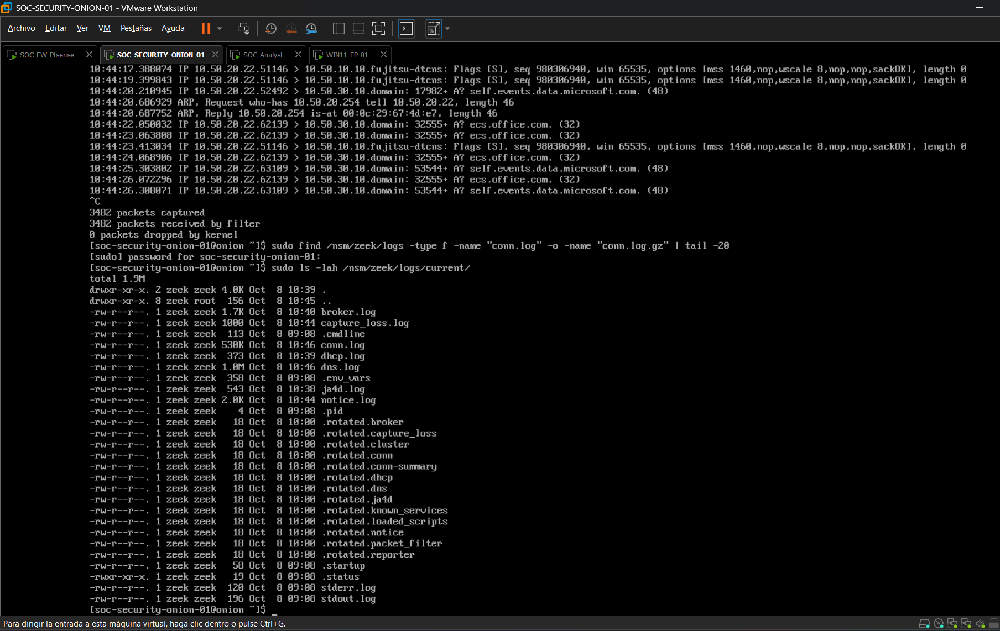
  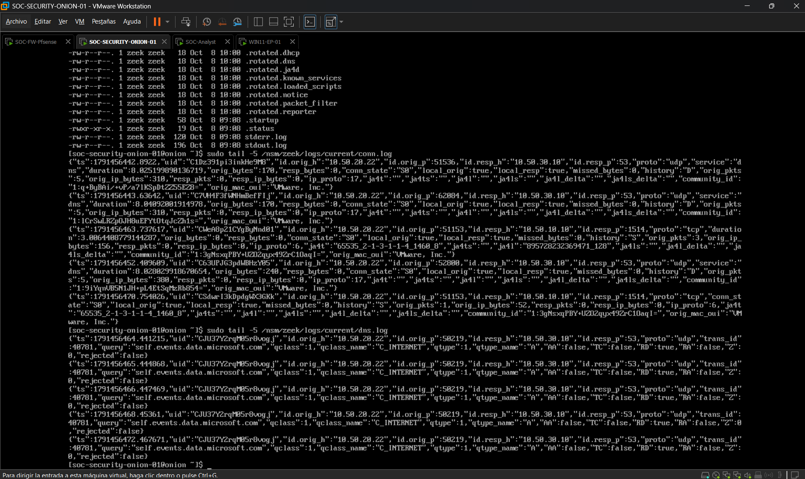
</p>

### 3. Confirmar la ingesta en Elasticsearch

El data stream `logs-zeek-so` existe en estado **GREEN** con retención de 90
días, `_count` devuelve documentos de Zeek indexados y el documento más reciente
es un evento `zeek.conn` de `10.50.20.22`.

<p>
  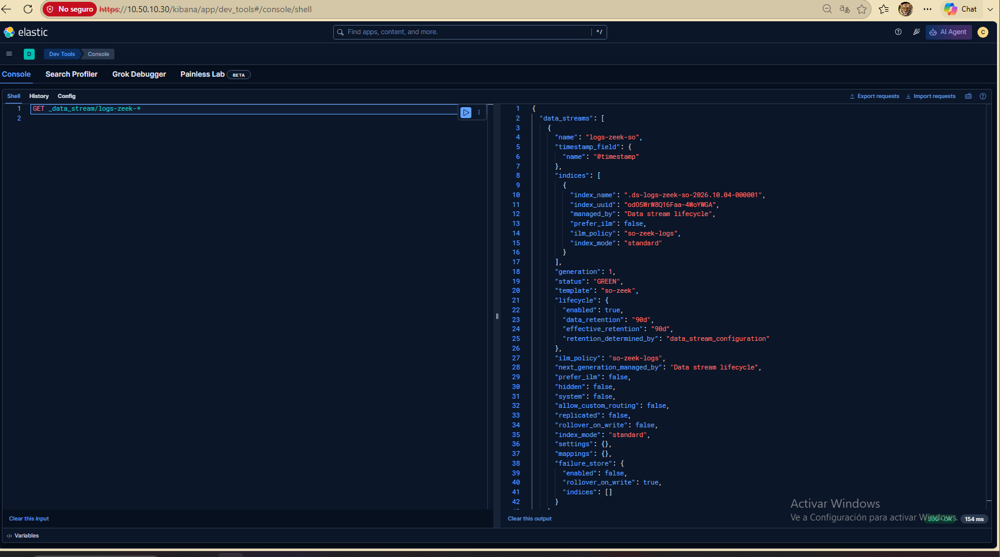
  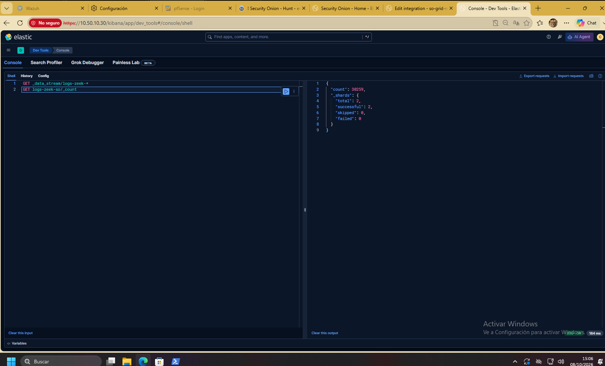
  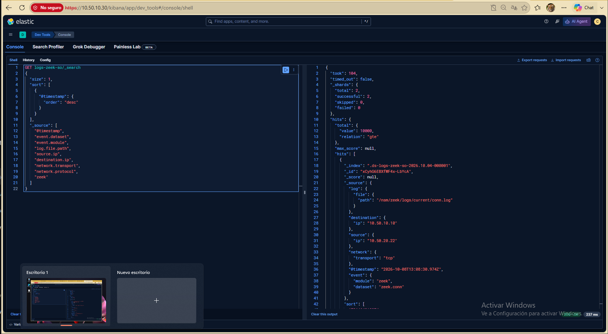
</p>

### 4. Acotar el hunt en Security Onion Hunt

La consulta `event.dataset:zeek.conn AND source.ip:10.50.20.22` aísla las
conexiones del endpoint. La línea temporal da una primera visión del volumen.

<p>
  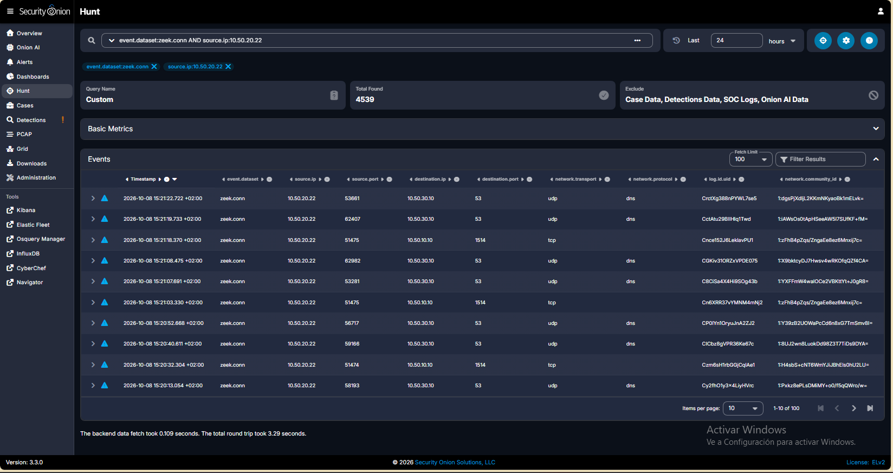
  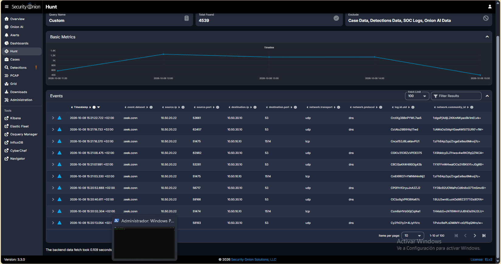
</p>

> Los recuentos de Hunt de estas capturas corresponden a una ventana móvil de 24
> horas en el momento de la captura. Son contexto, no el dataset analizado (paso 5).

### 5. Congelar el dataset

Los eventos `conn` de Zeek del endpoint se congelaron en
`sec-hunt-001-zeek-conn-2026-10-08.jsonl` (5.541 eventos) y se calculó su
SHA-256 para poder repetir el análisis exactamente sobre los mismos datos. El
fichero en bruto queda fuera de Git (`evidence/raw/` está ignorado).

```bash
sha256sum evidence/raw/sec-hunt-001-zeek-conn-2026-10-08.jsonl
# 308d4f4e9c27f44f9a7d903e784136cb96d532ea02fa0448a13b2b5fe29c34e0
```

### 6. Calcular rasgos de periodicidad y ordenar candidatos

```bash
python -m src.cli \
  --input evidence/raw/sec-hunt-001-zeek-conn-2026-10-08.jsonl \
  --output evidence/candidate-ranking.csv
```

Los eventos se filtran a `10.50.20.22` y se agrupan por IP destino, puerto
destino y transporte. Para cada grupo con al menos 5 eventos se calcula el
tiempo medio entre llegadas, la desviación típica poblacional y
CV = σ / μ. Los grupos se ordenan por CV ascendente. Un CV bajo indica timing
regular; no indica que sea malicioso.

### 7. Validar cada candidato con contexto

Cada grupo del ranking se contrasta con el protocolo, el destino y el contexto
de la infraestructura del laboratorio — ver
[`docs/analyst-validation.md`](docs/analyst-validation.md).

### 8. Registrar el veredicto y las limitaciones

Hallazgos, veredicto y limitaciones están en
[`evidence/findings.md`](evidence/findings.md) y
[`docs/limitations.md`](docs/limitations.md).

## Resultados

| | |
|---|---|
| Hipótesis | Un endpoint comprometido podría estar enviando *beacons* periódicos a infraestructura externa. |
| Activo | `WIN11-EP-01` (`10.50.20.22`) |
| Dataset | 5.541 eventos · 5.475 del endpoint · 13 grupos · 7 con ≥ 5 eventos |
| Veredicto | **No se confirma beaconing malicioso.** |

| Rango | Destino | Eventos | Intervalo medio | CV | Veredicto |
|---:|---|---:|---:|---:|---|
| 1 | `224.0.0.22` (IGMP, protocolo IP 2) | 5 | ≈ 3600 s | ≈ 0,00001 | Periódico benigno — informes de grupo multicast |
| 2 | `10.50.20.254:67/udp` (DHCP) | 5 | ≈ 3600 s | ≈ 0,00001 | Periódico benigno — renovación de concesión con pfSense |
| 3 | `10.50.10.10:1514/tcp` | 1.385 | 11,7 s | 0,66 | Tráfico del agente Wazuh — infraestructura del laboratorio |
| 4 | `239.255.255.250:1900/udp` | 8 | 2.040 s | 0,76 | Multicast SSDP — el timing por sí solo no indica malicia |
| 5 | `10.50.30.10:53/udp` | 3.772 | 4,3 s | 0,96 | DNS hacia DC01 — incluye reintentos mientras DC01 no estaba disponible |
| 6 | `10.50.10.10:1515/tcp` | 276 | 58,4 s | 1,24 | Registro del agente Wazuh — infraestructura del laboratorio |
| 7 | `224.0.0.252:5355/udp` | 12 | 1.309 s | 1,31 | Multicast LLMNR — el timing por sí solo no indica malicia |

Fuente: [`evidence/candidate-ranking.csv`](evidence/candidate-ranking.csv).
La lección clave: un detector basado solo en periodicidad habría escalado
primero DHCP e IGMP. El contexto es lo que convierte un candidato estadístico
en un veredicto.

## Uso

```
python -m src.cli --input PATH [--source-ip IP] [--min-events N] [--output CSV] [--top N]
```

| Opción | Valor por defecto | Descripción |
|---|---|---|
| `--input` | obligatorio | `conn.log` de Zeek en formato JSON Lines |
| `--source-ip` | `10.50.20.22` | Origen (`id.orig_h`) sobre el que se hace el hunt |
| `--min-events` | `5` | Mínimo de conexiones por grupo |
| `--output` | ninguno | Escribe el ranking completo en CSV |
| `--top` | `20` | Candidatos mostrados en consola |

## Estructura del repositorio

```
.
├── src/                 # pipeline: carga, rasgos, ranking, CLI
├── tests/               # pruebas unitarias + prueba extremo a extremo con la muestra sintética
├── samples/             # muestra sintética de Zeek conn con ground truth
├── scripts/             # generador determinista de la muestra
├── docs/                # hipótesis, metodología, validación del analista, limitaciones
├── evidence/            # ranking, hallazgos, manifiesto, capturas (raw/ ignorado en Git)
└── .github/workflows/   # CI: ruff + pytest en Python 3.10 y 3.12
```

La documentación de `docs/` y `evidence/` está en inglés.

## Tratamiento de datos

- Solo se analizó telemetría autorizada de un laboratorio aislado.
- La telemetría en bruto (`evidence/raw/`) y las capturas de paquetes están excluidas de Git.
- Las capturas de pantalla solo muestran direccionamiento privado del laboratorio.
- La muestra incluida es sintética y usa direcciones de documentación RFC 5737 para los hosts externos.

## Limitaciones y próximos pasos

Detalle en [`docs/limitations.md`](docs/limitations.md). En resumen: grupos de 5
eventos pueden parecer engañosamente regulares; agrupar por puerto funciona mal
con protocolos que no son TCP/UDP, como IGMP; un solo endpoint y una ventana
corta; el dataset del laboratorio no tiene casos maliciosos conocidos; parte del
tráfico refleja caídas del laboratorio (DC01 no disponible) y no la operación
normal.

Próxima iteración prevista:

- *Beacon* controlado desde el laboratorio (ground truth conocido) para medir la detección.
- Semántica por protocolo IP y rasgos tolerantes al *jitter* (histograma de intervalos / MAD).
- Enriquecimiento con DNS de Zeek, estado de conexión, patrones de bytes/duración y rol del activo.

<details>
<summary>Notas de resolución de problemas</summary>

Una agregación `terms` sobre `destination.ip` en 24 horas devolvió HTTP 429
`circuit_breaking_exception` (parent breaker, límite de ~570 MB) en el nodo
Evaluation. El breaker aparece como `TRANSIENT`.

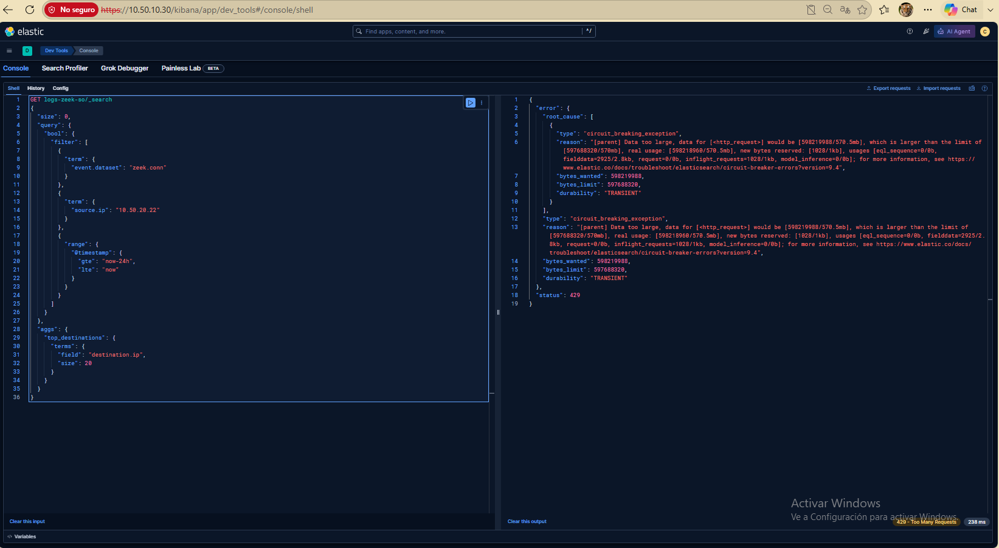

</details>

## Proyectos relacionados

- [soc-detection-engineering](https://github.com/CarlosGutierrezR/soc-detection-engineering) · LAB-DET-001: ingeniería de detección en Wazuh sobre el mismo laboratorio.
- [soc-security-automation](https://github.com/CarlosGutierrezR/soc-security-automation) · SEC-AUTO-001: automatización SOC/SOAR con aprobación del analista.

## 🌐 English summary

**SEC-HUNT-001** is a hypothesis-driven hunt for C2 beaconing in Zeek `conn`
telemetry from a segmented home SOC lab (pfSense, Security Onion 3.3.0, Wazuh,
Active Directory).

- **Method:** the endpoint's connections were frozen into a SHA-256-hashed
  dataset (5,541 events), grouped by destination/port/transport, and ranked by
  the coefficient of variation of inter-arrival times.
- **Result:** hypothesis **not confirmed**. The two most periodic groups were
  benign (IGMP multicast and DHCP lease renewal); every candidate has a
  documented analyst verdict.
- **Takeaway:** periodicity is a prioritisation signal, not a detection —
  context turns a statistical candidate into a verdict.
- **Reproduce:** `pytest` and `python -m src.cli --input samples/synthetic-conn.jsonl`
  (standard library only; synthetic sample with known ground truth). Docs in
  `docs/` and `evidence/` are in English.

## Autor

**Carlos Alberto Gutiérrez Rondón** · Cybersecurity & Data Engineer

[LinkedIn](https://www.linkedin.com/in/carlosgutierrez-rondon/) · [GitHub](https://github.com/CarlosGutierrezR)

## Licencia

[MIT](LICENSE)
